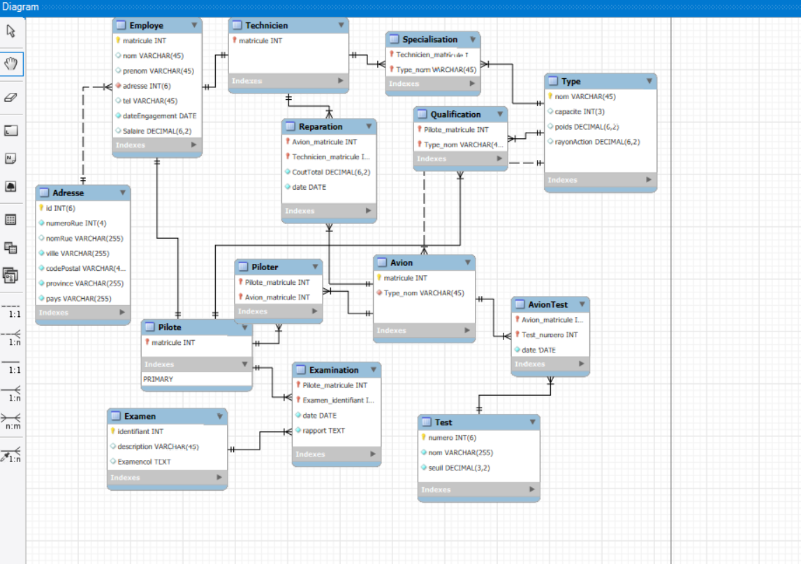
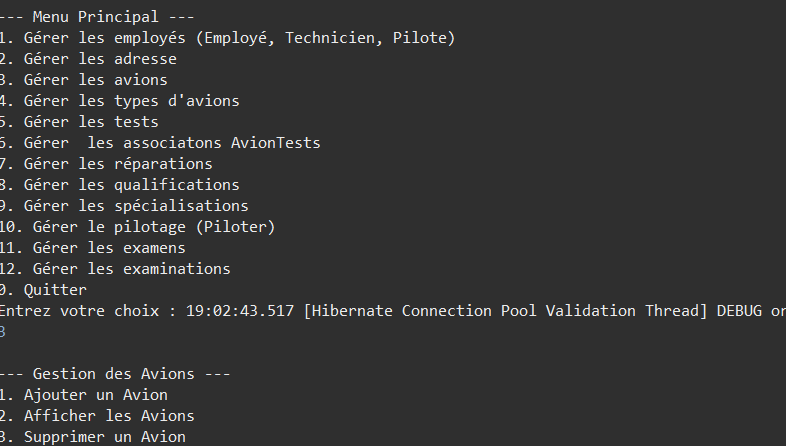
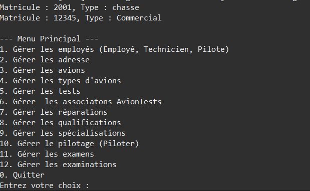

# ✈️ Hibernate - Base de Données d'une compagnie aérienne 

## 📝 Description

Ce projet met en œuvre **Hibernate** pour gérer une base de données sur une compagnie aérienne. Il permet d’effectuer des opérations CRUD (Create, Read, Update, Delete) sur les entités représentant les Avions, les Vols, les Types, Pilotes, Examens et plus encore.

Le projet sous Eclipse utilise **Java, Hibernate, Maeven et MySQL** pour interagir avec la base de données et fournir une gestion efficace des données aériennes.

---

## 🚀 Fonctionnalités

✔️ Connexion et gestion des entités via Hibernate  
✔️ Opérations CRUD sur les vols, avoins et types  
✔️ Mapping des relations entre les tables (One-to-Many, Many-to-One)  
✔️ Gestion des transactions et validation des données  
✔️ Fichiers de configuration `hibernate.cfg.xml` optimisés  
✔️ Menu dynamique pour gerer les entités    
 

---
## 📌 Captures d’écran

### 📊 Schéma de la base de données

### 📋Menu de l'application

### 🖥️ Resultat du choix

---

## 🏗️ Architecture du projet

📂 `src/main/java` → Code source des entités et DAO  
📂 `src/main/resources` → Configuration Hibernate (`hibernate.cfg.xml`)  
📄 `pom.xml` → Fichier Maven pour la gestion des dépendances  

---

## 🔧 Installation et Exécution
Ouverture du dossier AVIATION avec eclipse
le nom de la base de donnees a creer avec SQL Server est "aviation_db" et le mot de passe est "password"

### **1️⃣ Prérequis**
- Java JDK 21  
- MySQL Server  
- Maven  
- Hibernate

## Contributeurs

Merci à tous ceux qui m'ont aidé a realiser ce projet ! 🎉

- [SAMUEL SIMARD](https://github.com/SamuelSimard24)
- [Maxim Laurendeau](https://github.com/LAUM0026)
